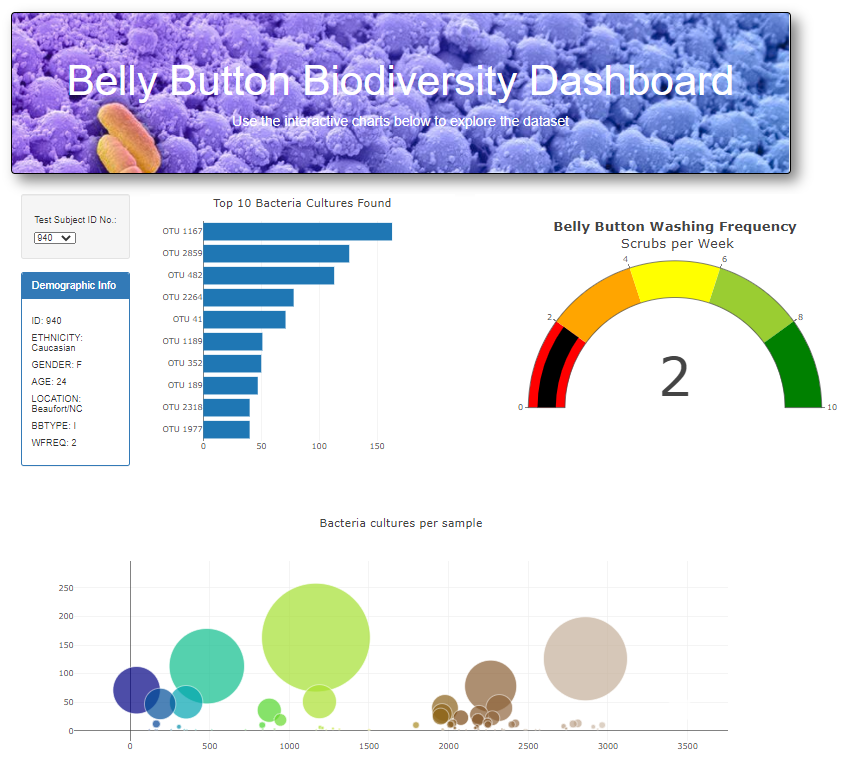
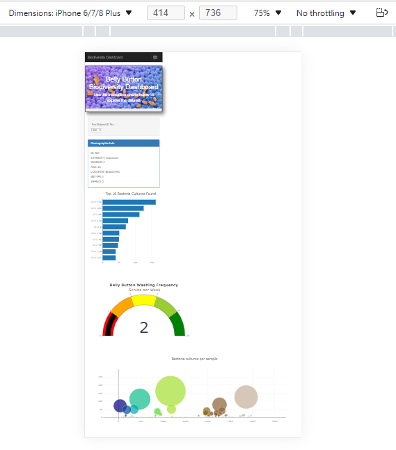

# Biodiversity_Board

### Background
Roza has a partially completed dashboard that she needs to finish. She has a completed panel for demographic information 
and now needs to visualize the bacterial data for each volunteer. Specifically, her volunteers should be able to identify 
the top 10 bacterial species in their belly buttons. That way, if Improbable Beef identifies a species as a candidate to 
manufacture synthetic beef, Roza's volunteers will be able to identify whether that species is found in their navel.

### Purpose: 
##### To identify the top 10 bacteria species in the belly button 
##### To create a horizontal Bar, Bubble and Gauge charts 
##### To customize the Dashboard 

### Results: 
Using JavaScript, Plotly and D3.js a horizontal, bubble and gauge charts were created 
The final dashboard is presented as follows: - 

    Mobile-responsive webpage

